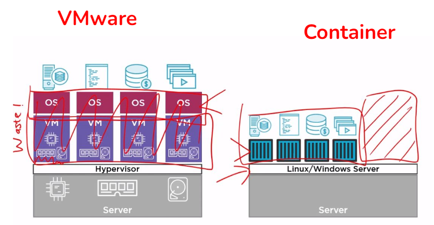
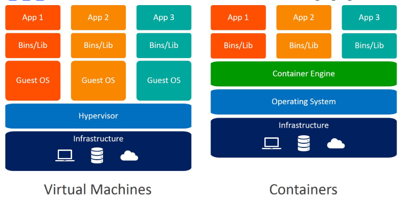

# Tecniche e Architetture Avanzate per lo Sviluppo del Software

### A.A. 2023-2024

## Docker

---

## Indice

1. I Vecchi Tempi
2. Cosa Sono i Containers e Docker?
3. Benefici dell'Utilizzo dei Docker Containers
4. Strumenti: docker-machine, docker-compose
5. Docker Registry e Docker Repository
6. Concetti Base

## I Vecchi Tempi

### Cambiamenti

- Nessuna applicazione, nessun business
- Vecchi tempi: un'app per server e come fare per renderla veloce e grande?
- Miglioramento con VMware: molte applicazioni in esecuzione su più macchine virtuali su un singolo server fisico
  - Spreco di troppi sistemi operativi
  - Amministrazione
  - Aggiornamenti...

### Soluzione VMware

- Ogni applicazione su un server
  

## Cosa Sono i Containers e Docker?



Gestisco un solo sistema operativo con unapp su ogni container

### Containers e Docker (1)

- I containers consentono di eseguire applicazioni isolandole dal sistema operativo sottostante, eliminando così gli sprechi e migliorando l'efficienza.

### Containers e Docker (2)

- ...

## Benefici dell'Utilizzo dei Docker Containers

### Lato Sviluppatori

- I containers forniscono l'applicazione (codice sorgente e tutte le relative dipendenze) sotto forma di un'unica unità standardizzata.
  - Eliminazione delle inconsistenze derivanti dallo specifico ambiente che si utilizza.
  - Ambienti di sviluppo più puliti e senza conflitti/problemi.

### Lato Operazioni IT

- In ambito DevOps, i containers riducono il ciclo di vita dello sviluppo dei sistemi.

## Strumenti: docker-machine, docker-compose

### docker-compose

- Strumento per definire ed eseguire applicazioni Docker multi-container tramite un file YAML.

### docker-machine

- Strumento per installare Docker Engine su host virtuali e gestirli con comandi docker-machine.

## Docker Registry e Docker Repository

### Docker Registry

- Un servizio di storage per le immagini Docker. Possibilità di gestire privatamente un proprio Docker Registry con il progetto "docker distribution".
- Esempi: Google Container, Amazon ECR...

### Docker Hub

- Registro pubblico messo a disposizione da Docker per qualunque utente/compagnia. Possibilità di gestire un numero illimitato di Docker repository pubblici.

### Docker Repository

- Collezione di immagini Docker con lo stesso nome ma differenziate per tag (versione dell'applicazione).

## Concetti Base

### Immagini e Containers

#### Immagine Docker

- Pacchetto eseguibile autonomo che include tutto il necessario per eseguire un'applicazione (codice, runtime, librerie, variabili d'ambiente, file di configurazione).
- Rappresenta il modello da cui i containers vengono eseguiti.

#### Container Docker

- Istanza di runtime di un'immagine, eseguita in modo isolato dall'ambiente host.
- Creazione, avvio, arresto, spostamento o eliminazione di un container tramite Docker API o CLI.

### Docker Engine

- Software core capace di gestire immagini, containers, volumi, rete.
- Comandi attraverso Docker CLI per gestire le diverse risorse.

### Dockerfile

- Documento di testo contenente i comandi necessari per creare un'immagine con un'applicazione all'interno.
- Esempio:
  ```dockerfile
  FROM busybox
  WORKDIR /
  COPY hello.txt .
  COPY hello-script.sh .
  RUN chmod +x hello-script.sh
  CMD ["bin/ash","hello-script.sh"]
  ```
