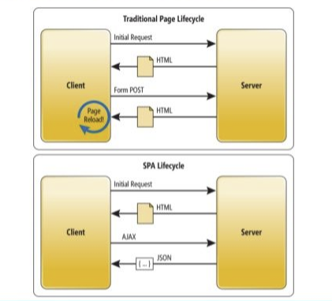

# Single Page Application

## Sito tradizionale

- html, css, js
- server based: ogni click -> richiesta al server -> risposta -> ricaricamento pagina
- tante pagine

## Al giorno d'oggi

- SPA: Single Page Application
- browser moderni
- javascript + potente (framework)
- html5
- più focus su UX(user experience), come un'applicazione
- UI più veloce e interattiva
- anche offline
- responsiva, su diversi dispositivi

Viene caricata una sola volta la pagina e poi solo dati, non più reload costanti.
Molta interazione gestita lato client.

